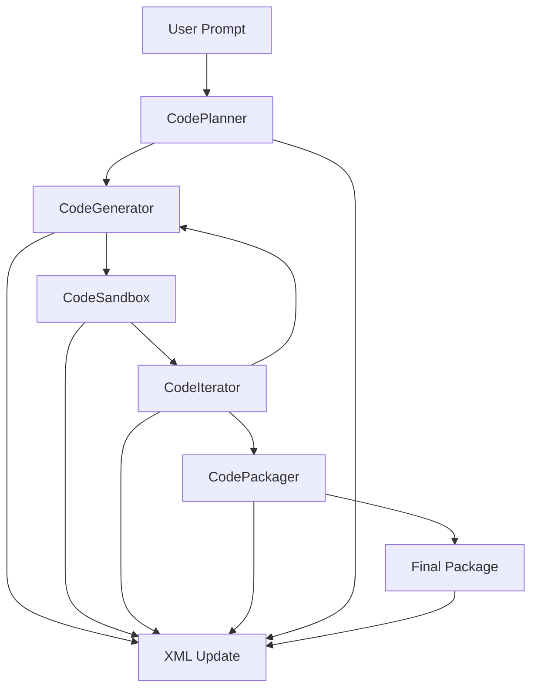

Note: The node H[XML Update] represents the central XML being updated at each step, ensuring that all nodes interact through the XML structure.

# Detailed Node Descriptions and Interactions

##A: User Prompt

Input: High-level description or requirements provided by the user.
Action: Passes the prompt to the CodePlanner.

## B: CodePlanner

Action:
Receives the user prompt.
Parses and decomposes it into structured requirements.
Identifies necessary modules and their roles.
Defines the file structure and maps files to modules.
Outputs this detailed plan into the <planning> section of the XML.
Output: XML with comprehensive planning details.

## C: CodeGenerator

Action:
Reads the <planning> section from the XML.
Generates code files as per the defined structure and requirements.
Populates the <generation> section with generated code, dependencies, and initial tests.
Output: XML with generated code and test stubs.

## D: CodeSandbox

Action:
Sets up the environment based on dependencies.
Executes the generated code.
Runs all tests and captures results.
Updates the XML with test outcomes in <test_results>.
Output: XML with test results.

## E: CodeIterator

Action:
Analyzes <test_results> against <requirements>.
Identifies discrepancies or failures.
Modifies the planning or generation sections to address issues.
Updates the XML to reflect changes needed.
Output: Revised XML indicating necessary code or requirement updates.

## C: CodeGenerator (Iterative Loop)

Action:
Receives updated planning details.
Regenerates code or modifies existing code to fix issues.
Updates the <generation> section.
Output: XML with updated code and potentially new test cases.

## D: CodeSandbox (Re-execution)

Action:
Executes the revised code.
Runs all tests again.
Updates test results.
Output: XML with updated test outcomes.
Loop Continues (E → C and C → D)

Condition: Continue iterating until all tests pass and requirements are met.

## F: CodePackager

Action:
Once iterations are complete and all tests pass, gathers all finalized code.
Compiles dependencies and packaging scripts.
Updates the <package> and <build> sections with necessary metadata and build logs.
Output: Final XML with packaging details and build status.

## G: Final Package

Action: Deliver the fully functional, tested, and packaged project ready for deployment or distribution.
Output: The end product—a ready-to-deploy codebase.